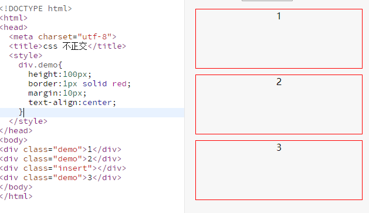
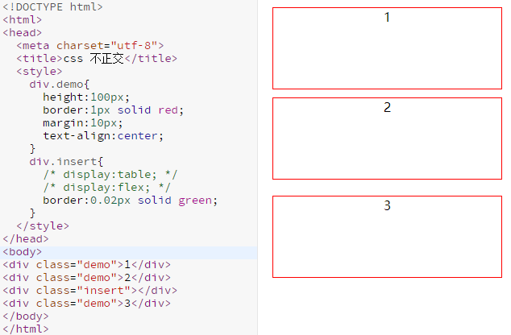

# 学了一年，我发现 CSS 难 易 点

## CSS 难学

学了一年，发现 css很难学，主要 CSS 是没有逻辑可言的！它不正交，

### 什么是正交

我们调过显示器的「亮度」、「色调」和「饱和度」吧。

- 「亮度」就是明暗程度，值越大，屏幕越亮。
- 「色调」就是颜色，你通过调色调，可以把红色调成绿色。
- 「饱和度」就是鲜艳程度，值越大越鲜艳。

「正交」就是，你调节这三者中的一个时，不影响其他两个效果。

- 你调节「亮度」的时候「色调」和「饱和度」不会变化。
- 你调节「色调」的时候「亮度」和「饱和度」不会变化。
- 你调节「饱和度」的时候「亮度」和「色调」不会变化。

「正交」看起来应该是理所当然的，对吧。

想象一下「不正交」的情况：你调节「亮度」的时候，「色调」和「饱和度」会跟着无规律的变化。如果是这样，你会调得想死，因为你很难调到你想要的效果。

而　CSS，就是「不正交」的。

什么叫不正交：我改变一个属性，其它属性也会改变。不信请看

```html
<style>
      div.demo{
      height:100px;
      border:1px solid red;
      margin-top: 10px;
    }
</style>
<body>
	<div class="demo"></div>
    <div class="demo"></div>
    <div class="insert"></div>
    <div class="demo"></div>
</body>
```


此时这个这三个 div 的显示效果如图：




但如果我们修改一下它的样式

```html
  <style>
    div.demo{
      height:100px;
      border:1px solid red;
      margin:10px;
    }
    div.insert{
      /* display:table; */
      /* display:flex; */
      border:0.02px solid green;
    }
  </style>
```


我们发现，修改 .insert 的 border 和 display 为 table 和 flex 时，块2和块3之间的距离增大了




我们再看，元素是 display:inline/inline-block, 如果 position 是absolute,则 css会修改其 display 为 block 。


写的  .child　display 明明是 inline, css 却给我修改成了  block 。这就是 css 的另一个不正交之处。


## CSS 易学

### 记住常见写法

1. 记住几个常见的写法即可：两种水平居中、三种垂直居中、两种左右结构、两种左中右结构、一行省略、多行省略
2. 别人研究出来直接用即可（[animate.css](https://daneden.github.io/animate.css/)）
3. 巧用工具 :   CSS 3 Generator

### 学好 CSS？

1. 通读 specs
2. 20篇以上博客（[张鑫旭](http://www.zhangxinxu.com/wordpress/category/css/)）
3. 做好「学了但是没有什么卵用」的心理准备